# 🔄 Workflows & Best Practices

This guide outlines proven workflows for different development scenarios using the Claude Orchestrator. Each workflow includes step-by-step procedures, communication patterns, and quality gates.

## 🚀 Project Initialization Workflows

### New Project Startup Workflow

```mermaid
graph TD
    A[User Request: "Start Project X"] --> B[Orchestrator Analysis]
    B --> C[Create Tmux Session]
    C --> D[Deploy Project Manager]
    D --> E[PM Analyzes Requirements]
    E --> F[PM Deploys Development Team]
    F --> G[Team Introductions & Planning]
    G --> H[Initial Sprint Planning]
    H --> I[Development Begins]
    I --> J[Regular Check-ins]
```

#### Step-by-Step Process:

**1. Project Request Analysis (Orchestrator)**
```bash
# User says: "Start a new e-commerce project"
# Orchestrator response:
./orchestrator.py start ecommerce-platform /path/to/project --template enterprise-team
```

**2. Session Creation & PM Deployment**
```bash
# Creates: claude-ecommerce-platform session
# Window 0: Project Manager deployed with briefing
```

**3. Project Manager Initial Analysis**
- Reviews project_spec.md if available
- Analyzes project requirements and scope
- Determines optimal team composition
- Creates initial project plan and timeline

**4. Team Deployment (PM Responsibility)**
```bash
# PM deploys based on project needs:
# Window 1: Frontend Developer (if web app)
# Window 2: Backend Developer
# Window 3: QA Engineer
# Window 4: DevOps Engineer (if needed)
```

**5. Team Coordination & Planning**
- PM introduces team members to each other
- Shares project vision and requirements
- Assigns initial tasks and responsibilities
- Establishes communication protocols

### Quick Prototype Workflow

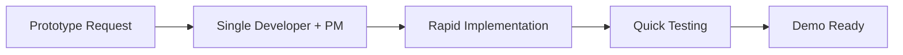

**Use Case:** "Build a quick demo of the user dashboard"

**Team Composition:** PM + Senior Full-Stack Developer

**Timeline:** 1-3 days

**Process:**
1. **Requirement Gathering (30 minutes)**
   - PM clarifies scope and demo objectives
   - Defines success criteria and constraints
   - Identifies key features to demonstrate

2. **Rapid Development (80% of time)**
   - Developer focuses on core functionality
   - Minimal styling, maximum functionality
   - Quick iterations with PM feedback

3. **Basic Testing (15% of time)**
   - PM performs acceptance testing
   - Developer fixes critical issues only
   - QA involved only for major concerns

4. **Demo Preparation (5% of time)**
   - PM prepares demo script
   - Developer ensures stable deployment
   - Documentation for handoff if needed

## 🔄 Feature Development Workflows

### Standard Feature Development

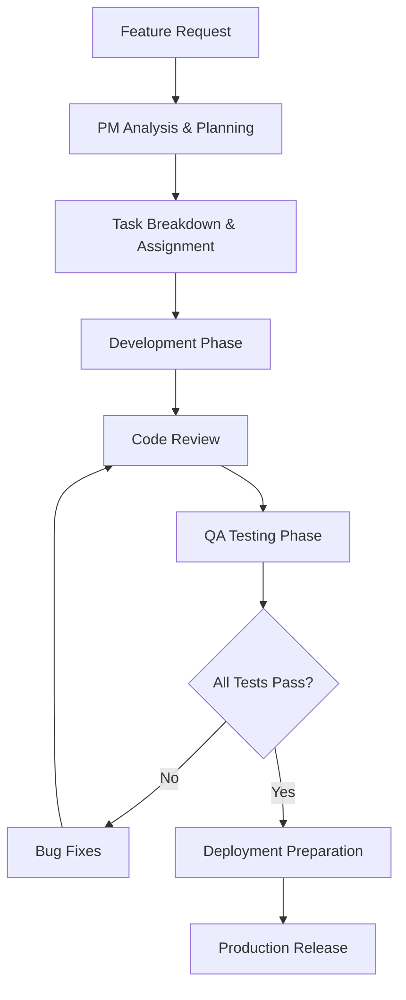

#### Detailed Process:

**Phase 1: Planning & Analysis (PM Lead)**
```
Duration: 0.5-1 day
Deliverables:
- Feature specification document
- Technical design decisions
- Task breakdown with estimates
- Risk assessment
- Acceptance criteria definition
```

**Phase 2: Development (Developer Lead)**
```
Duration: 2-5 days (depending on complexity)
Activities:
- Feature branch creation
- Implementation following TDD practices
- Unit test development
- Integration with existing code
- Self-testing and bug fixes
- Code documentation
```

**Phase 3: Code Review (Cross-team)**
```
Duration: 0.5-1 day
Process:
- Developer submits pull request
- PM reviews for requirements compliance
- Another developer reviews for technical quality
- QA reviews test coverage and approach
- All feedback addressed before approval
```

**Phase 4: QA Testing (QA Lead)**
```
Duration: 1-2 days
Activities:
- Functional testing against acceptance criteria
- Integration testing with existing features
- User experience testing
- Performance testing
- Security testing (if applicable)
- Browser/device compatibility testing
```

**Phase 5: Deployment (DevOps/PM Lead)**
```
Duration: 0.5 day
Activities:
- Staging environment deployment
- User acceptance testing
- Production deployment preparation
- Go-live execution
- Post-deployment monitoring
```

### Emergency Bug Fix Workflow

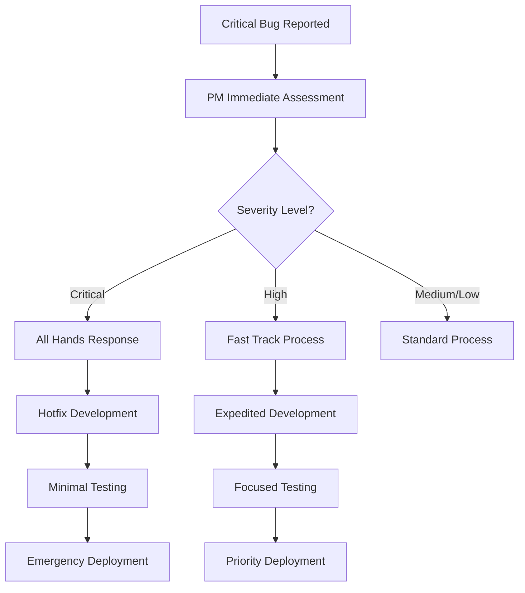

#### Critical Bug Response (< 1 hour to fix):
1. **Immediate Triage (5 minutes)**
   - PM assesses impact and urgency
   - Determines if rollback is needed
   - Assigns all available resources

2. **Rapid Development (30-45 minutes)**
   - Senior developer implements hotfix
   - PM coordinates and removes blockers
   - QA prepares for rapid testing

3. **Express Testing (10-15 minutes)**
   - QA focuses only on bug resolution
   - PM validates fix against original issue
   - Minimal regression testing for critical paths

4. **Emergency Deployment (5 minutes)**
   - DevOps executes deployment
   - All team monitors for issues
   - Post-deployment verification

## 👥 Team Coordination Workflows

### Daily Standup Workflow

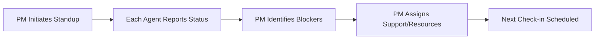

**Timing:** Every 24 hours, or more frequently for fast-moving projects

**Process:**
1. **PM Broadcasts Standup Request (2 minutes)**
   ```
   DAILY STANDUP REQUEST [{{date}}]
   All team members, please provide status update using the standard template.
   Focus on: completed work, today's goals, blockers needing assistance.
   ```

2. **Individual Agent Responses (5 minutes each)**
   - Each agent uses the standardized template
   - Clear, specific information about progress
   - Honest reporting of challenges and blockers

3. **PM Analysis & Coordination (10 minutes)**
   - Identifies cross-team dependencies
   - Resolves resource conflicts
   - Assigns assistance for blocked items
   - Updates project timeline and risks

4. **Follow-up Actions (Ongoing)**
   - PM coordinates one-on-one problem solving
   - Resources are reallocated as needed
   - Escalation to Orchestrator if major issues

### Code Review Workflow

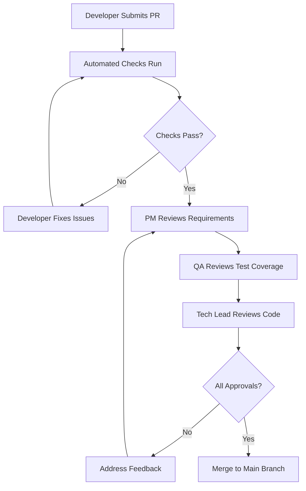

**Roles & Responsibilities:**

**Developer (Submitter):**
- Comprehensive PR description with context
- Self-review before submission
- Responsive to feedback and questions
- Maintains PR in mergeable state

**Project Manager:**
- Reviews for requirements compliance
- Validates business logic correctness
- Ensures proper documentation
- Approves for functional correctness

**QA Engineer:**
- Reviews test coverage and quality
- Validates testing approach
- Identifies missing test scenarios
- Approves for testability

**Technical Reviewer:**
- Reviews code quality and architecture
- Ensures adherence to coding standards
- Identifies potential performance issues
- Approves for technical excellence

### Cross-Project Knowledge Sharing

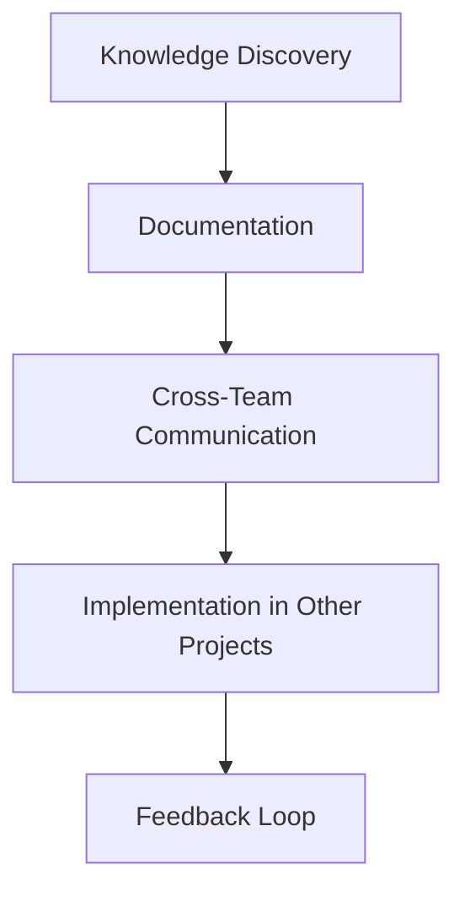

**Scenarios:**
- **Reusable Solution Found:** "Authentication pattern works well in Project A"
- **Common Problem Solved:** "Performance optimization technique discovered"
- **Best Practice Identified:** "Testing strategy proves highly effective"

**Process:**
1. **Knowledge Identification**
   - Agent discovers valuable solution or pattern
   - PM evaluates applicability to other projects
   - Orchestrator identifies relevant projects

2. **Documentation & Sharing**
   - Create reusable documentation
   - Share with relevant project teams
   - Provide implementation guidance

3. **Cross-Project Implementation**
   - Other teams evaluate and adapt solution
   - Implementation with project-specific modifications
   - Results and feedback collected

4. **Continuous Improvement**
   - Success stories documented
   - Lessons learned incorporated
   - Best practices updated

## 🔧 Development Process Workflows

### Test-Driven Development (TDD) Workflow

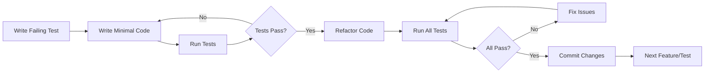

**Implementation by Agent Type:**

**Developers:**
- Write test first, then implementation
- Commit only when all tests pass
- Refactor continuously for code quality
- Maintain high test coverage (>85%)

**QA Engineers:**
- Review test quality and coverage
- Suggest additional test scenarios
- Validate test assertions and edge cases
- Ensure integration test coverage

**Project Managers:**
- Monitor test coverage metrics
- Ensure TDD practice compliance
- Remove blockers for testing tools/setup
- Validate that tests match requirements

### Continuous Integration Workflow

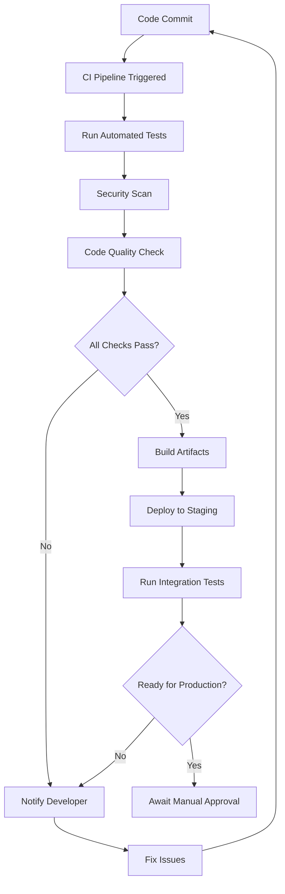

**Automated Checks:**
- **Linting:** Code style and formatting
- **Unit Tests:** All existing tests must pass
- **Security Scan:** Dependency vulnerabilities
- **Performance Check:** Build time and size limits
- **Integration Tests:** API and database connectivity

**Responsibilities:**

**DevOps Engineer:**
- Maintain CI/CD pipeline configuration
- Monitor pipeline performance and reliability
- Troubleshoot build and deployment issues
- Optimize pipeline speed and efficiency

**Developers:**
- Ensure code passes all automated checks
- Fix pipeline failures quickly
- Maintain test quality and coverage
- Follow branching and commit conventions

**QA Engineers:**
- Review and improve automated test suites
- Monitor integration test results
- Validate staging environment deployments
- Provide feedback on test coverage gaps

## 📊 Quality Assurance Workflows

### Comprehensive Testing Workflow

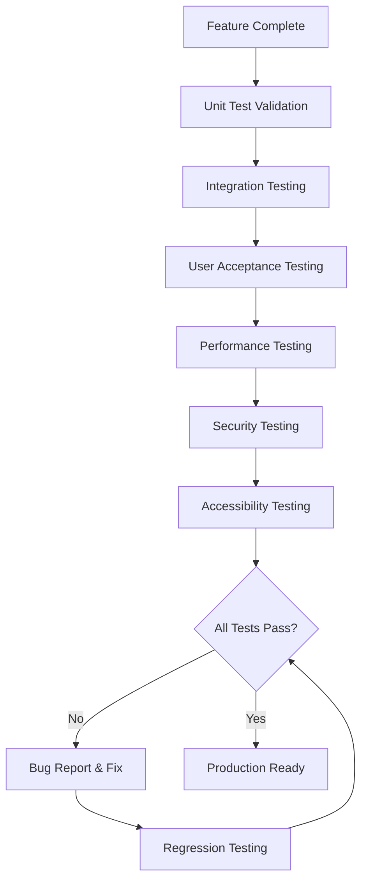

**Testing Phases:**

**Phase 1: Unit Test Validation (QA + Developer)**
- Verify all new code has unit tests
- Validate test quality and edge case coverage
- Ensure tests are maintainable and readable
- Check for proper mocking and isolation

**Phase 2: Integration Testing (QA Lead)**
- API endpoint testing with real data
- Database integration verification  
- Third-party service integration
- Error handling and edge case scenarios

**Phase 3: User Acceptance Testing (QA + PM)**
- Validate against original requirements
- User workflow and experience testing
- Business logic correctness verification
- Cross-browser and device compatibility

**Phase 4: Performance Testing (QA + DevOps)**
- Load testing under normal conditions
- Stress testing at peak capacity
- Database query performance
- Frontend rendering performance

**Phase 5: Security Testing (QA + Security Specialist)**
- Input validation and sanitization
- Authentication and authorization
- Data encryption and protection
- Common vulnerability scanning (OWASP)

### Bug Triage & Resolution Workflow

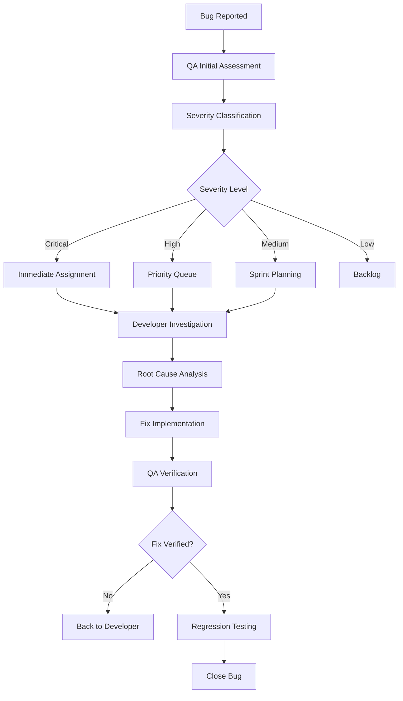

**Severity Definitions:**

**Critical (Fix within 2 hours):**
- Application completely unusable
- Data loss or corruption
- Security vulnerability exposed
- Major functionality broken for all users

**High (Fix within 24 hours):**
- Major feature not working
- Performance significantly degraded
- Affects majority of users
- Workaround exists but difficult

**Medium (Fix within sprint):**
- Minor feature issues
- Affects some users
- Easy workaround available
- Cosmetic issues with functional impact

**Low (Fix when convenient):**
- Cosmetic issues only
- Affects very few users
- Minor usability improvements
- Enhancement requests

## 🚀 Deployment & Release Workflows

### Production Release Workflow

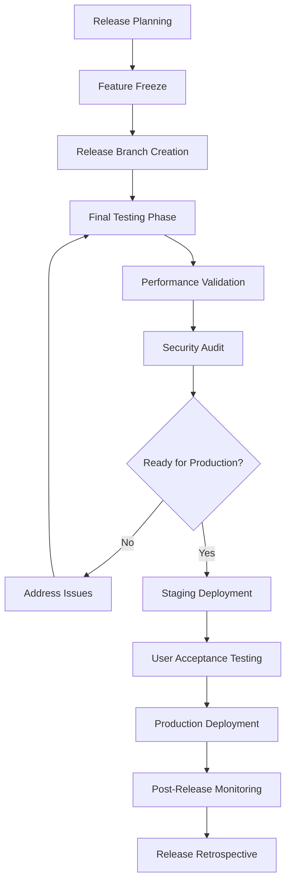

**Pre-Release Checklist:**
```
□ All planned features completed and tested
□ No critical or high-severity bugs
□ Performance benchmarks met
□ Security scan passed
□ Documentation updated
□ Database migrations tested
□ Rollback procedure prepared
□ Monitoring and alerting configured
□ Team availability for post-release support
□ Stakeholder communication completed
```

**Release Roles:**

**Project Manager:**
- Coordinates release timeline and communication
- Validates feature completeness
- Manages stakeholder expectations
- Approves final go/no-go decision

**DevOps Engineer:**
- Executes deployment procedures
- Monitors system health during release
- Manages infrastructure scaling
- Prepares rollback procedures

**QA Engineer:**
- Validates final release candidate
- Executes release testing procedures
- Monitors for post-release issues
- Validates rollback procedures if needed

**Developers:**
- Support deployment troubleshooting
- Available for emergency fixes
- Monitor application logs and metrics
- Document any issues discovered

### Rollback Procedures

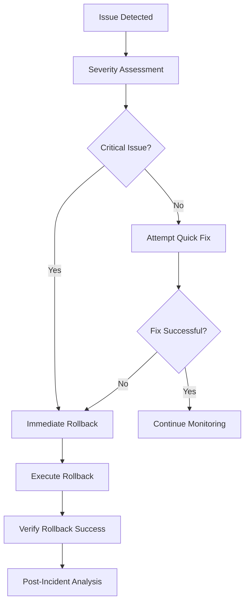

**Rollback Decision Matrix:**

| Issue Type | Response Time | Action |
|------------|---------------|---------|
| Data corruption | Immediate | Automatic rollback |
| Authentication failure | 5 minutes | Immediate rollback |
| Performance degradation | 15 minutes | Attempt fix, then rollback |
| Minor UI issues | 30 minutes | Fix in place |
| Non-critical bugs | Next release | Document for future fix |

This comprehensive workflow system ensures that all aspects of development, testing, and deployment are handled systematically with clear responsibilities and quality gates at every step.